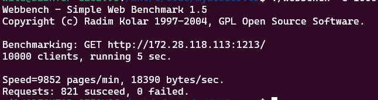
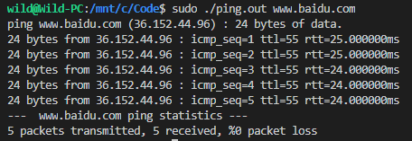
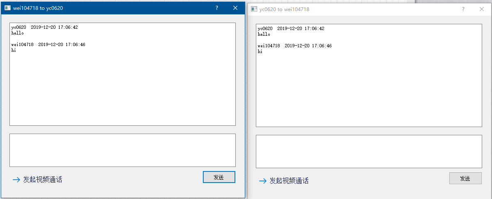
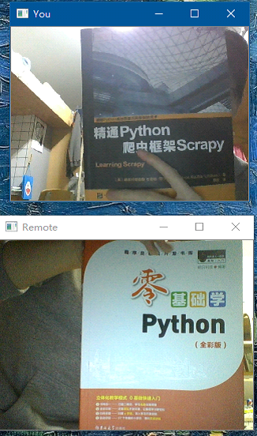
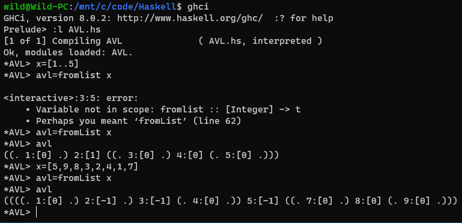
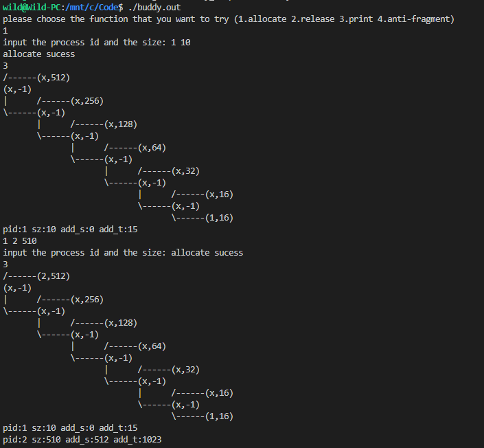
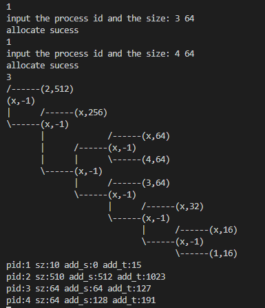
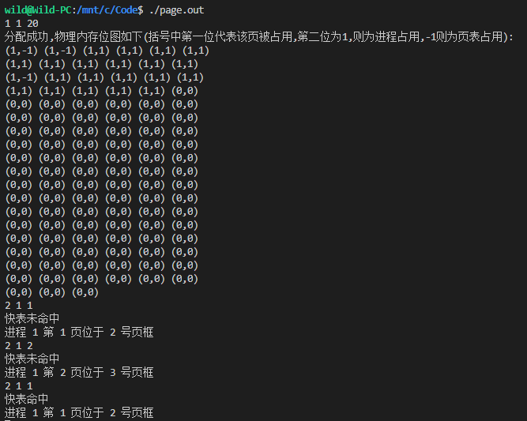
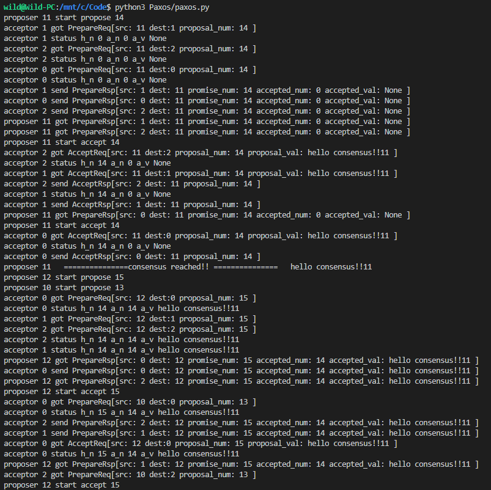
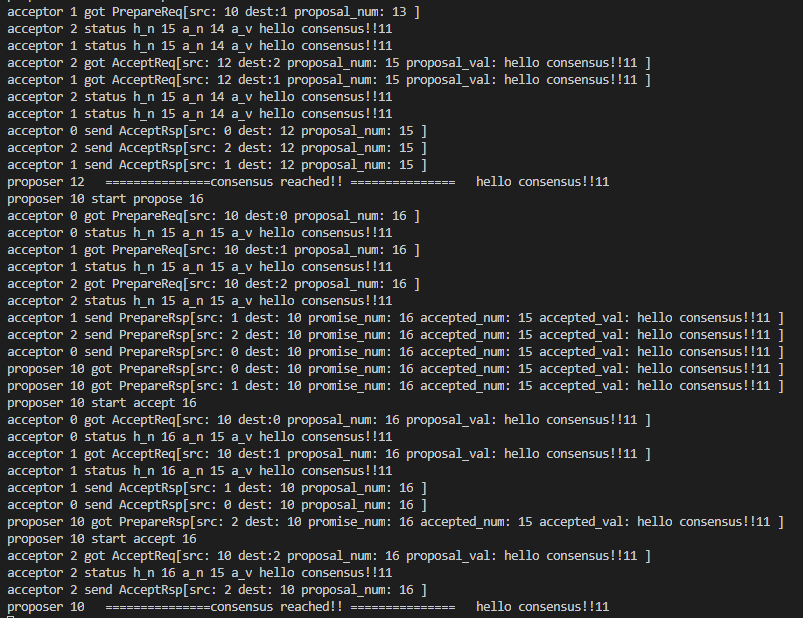

## WebServer
在Linux环境下实现的C++轻量Web服务器

1. 使用多线程高效处理客户端请求，实现线程池管理线程

2. 使用非阻塞式socket，epoll实现I/O复用，支持LT及ET触发

3. 实现Reactor事件处理模式，及同步I/O模拟的Proactor模式

4. 主从状态机解析http报文的GET及POST请求

在WSL2 下进行测试，I/O瓶颈较大，但仍然可以处理上万的并发请求

## Network/Ping
ICMP的ping命令，linux下

## Ychat
粗糙的图形界面，增加了用户数据库，可进行文本，语音，视频通话

## Haskell
Haskell 编写了AVL树，红黑树写了插入部分，删除部分待完成

## HUST2020
尝试用较标准的方式去写C/C++，使用了google测试模块

## OS
编写了伙伴堆内存分配算法；页式管理算法，支持多级页表，TLB替换算法采用FIFO

## Paxos
多线程模拟Paxos算法，通信采用消息队列

## R
海草数量分析案例，电子游戏销量分析案例
